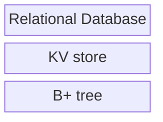

# tinydb

## architecture

```mermaid
block-beta
columns 1
  relational_db["Relational Database"]
  kv_store["KV store"]
  bplus_tree["B+ tree"]
```

## reference
- [b+tree visualization](https://www.cs.usfca.edu/~galles/visualization/BPlusTree.html)
